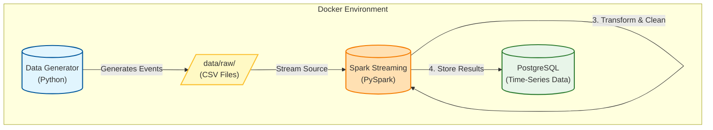

# Real-Time Data Ingestion Using Spark Streaming

This project implements a robust **real-time data ingestion pipeline** that simulates an e-commerce platform's user activity. It generates high-volume fake events, streams them using **Apache Spark Structured Streaming**, and persistently stores processed data in a **PostgreSQL** database.

## 🏗️ System Architecture

The pipeline consists of three main stages: Data Generation, Stream Processing, and Persistence.



## ✨ Features

- **Real-Time Processing**: Ingests and processes user events with low latency (~10s).
- **Fault Tolerance**:
  - **Checkpointing**: Resumes processing from the exact last offset after failures.
  - **Error Handling**: Routes malformed records to a dedicated `data/error/` directory.
- **Data Integrity**:
  - **Deduplication**: Ensures each `event_id` is processed only once.
  - **Schema Validation**: Enforces strict data types for downstream consistency.
- **Robust Storage**: Uses PostgreSQL with optimized indexes for analytical queries.

## 🛠️ Technology Stack

| Component | Technology | Version | Description |
|-----------|------------|---------|-------------|
| **Streaming Engine** | Apache Spark | 3.5 | Structured Streaming with PySpark |
| **Database** | PostgreSQL | 15.x | Relational storage for processed events |
| **Containerization** | Docker | 24+ | Isolates services (Spark, Postgres) |
| **Language** | Python | 3.9+ | Data generation and Spark job logic |

## 🚀 Getting Started

### Prerequisites

- **Docker Desktop** installed and running.
- **Git** (optional, for cloning).

### Installation & Running

1.  **Clone the Repository** (or download source):
    ```bash
    git clone <repository-url>
    cd Real-Time-Data-Ingestion-Using-Spark-Streaming
    ```

2.  **Start Services** (in background):
    ```bash
    docker-compose up -d
    ```
    *This starts the PostgreSQL database and the Spark master/worker nodes.*

3.  **Run the Streaming Pipeline**:
    You can run the generator and the spark job locally or inside the container. Assuming local execution with Python installed:
    
    a. **Start Data Generator**:
    ```bash
    # Run in a separate terminal
    pip install faker
    python src/data_generator.py
    ```

    b. **Submit Spark Job**:
    ```bash
    # Run in another terminal
    spark-submit --packages org.postgresql:postgresql:42.7.1 src/spark_streaming_to_postgres.py
    ```

## 📂 Project Structure

```bash
.
├── config/                 # Configuration files
├── data/
│   ├── raw/                # Landing zone for generated CSVs (monitored by Spark)
│   ├── error/              # Quarantine for invalid records
│   └── processed/          # (Optional) Parquet/Delta output
├── docs/                   # Detailed documentation
├── sql/
│   └── postgres_setup.sql  # Database schema & initialization
├── src/
│   ├── data_generator.py   # Simulates user traffic
│   └── spark_streaming_to_postgres.py  # Main Spark job
├── docker-compose.yml      # Service orchestration
└── Dockerfile              # Custom image definitions
```

## 📊 Database Schema

The `user_events` table is designed for high-throughput writes and analytical reads.

| Column | Type | Description |
|--------|------|-------------|
| `id` | SERIAL | Primary Key |
| `event_id` | VARCHAR | **Unique** event identifier (dedup key) |
| `user_id` | VARCHAR | User performing the action |
| `event_type` | VARCHAR | `view`, `add_to_cart`, or `purchase` |
| `product_id` | VARCHAR | ID of the product |
| `price` | DECIMAL | Product price |
| `event_timestamp` | TIMESTAMP | Time of occurrence |
| `created_at` | TIMESTAMP | Ingestion time |

## 🔍 Monitoring

- **Spark UI**: Access at `http://localhost:4040` (when running locally) to view active streams and processing rates.
- **Postgres Data**:
    ```sql
    -- Connect to DB
    psql -h localhost -U postgres -d ecommerce_events

    -- Check event count
    SELECT count(*) FROM user_events;
    
    -- See recent activity
    SELECT * FROM user_events ORDER BY event_timestamp DESC LIMIT 5;
    ```

## 🤝 Contributing

Contributions are welcome! Please open an issue or submit a pull request for any improvements.
