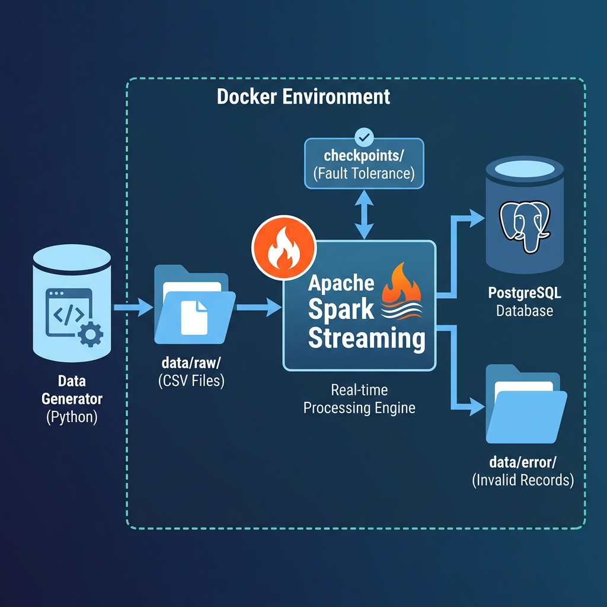

# Real-Time Data Ingestion Using Spark Streaming

This project implements a robust **real-time data ingestion pipeline** that simulates an e-commerce platform's user activity. It generates high-volume fake events, streams them using **Apache Spark Structured Streaming**, and persistently stores processed data in a **PostgreSQL** database.

## System Architecture

The pipeline consists of three main stages: Data Generation, Stream Processing, and Persistence.



## Features

- **Real-Time Processing**: Ingests and processes user events with low latency (~10s).
- **Fault Tolerance**:
  - **Checkpointing**: Resumes processing from the exact last offset after failures.
  - **Error Handling**: Routes malformed records to a dedicated `data/error/` directory.
- **Data Integrity**:
  - **Deduplication**: Ensures each `event_id` is processed only once.
  - **Schema Validation**: Enforces strict data types for downstream consistency.
- **Robust Storage**: Uses PostgreSQL with optimized indexes for analytical queries.
- **Performance Logging**: Detailed metrics logged to `logs/` directory for monitoring.

## Technology Stack

| Component | Technology | Version | Description |
|-----------|------------|---------|-------------|
| **Streaming Engine** | Apache Spark | 3.5 | Structured Streaming with PySpark |
| **Database** | PostgreSQL | 15.x | Relational storage for processed events |
| **Containerization** | Docker | 24+ | Isolates services (Spark, Postgres) |
| **Language** | Python | 3.9+ | Data generation and Spark job logic |

## Getting Started

### Prerequisites

- **Docker Desktop** installed and running.
- **Git** (optional, for cloning).

### Installation

1. **Clone the repository**:
   ```bash
   git clone https://github.com/evans-ankomah/Real-time-Data-Ingestion-Using-Spark-Streaming.git
   cd Real-Time-Data-Ingestion-Using-Spark-Streaming
   ```

2. **Start Services** (in background):
   ```bash
   docker compose up -d --build
   ```
   *This starts the PostgreSQL database and the Spark container.*

3. **Run the Streaming Pipeline**:

   a. **Start Spark Streaming Job**:
   ```bash
   docker compose exec spark spark-submit //app/src/spark_streaming_to_postgres.py
   ```

   b. **Start Data Generator** (in a new terminal):
   ```bash
   docker compose exec spark python3 //app/src/data_generator.py --events-per-second 10 --duration 60
   ```

4. **Verify Data in PostgreSQL**:
   ```bash
   docker compose exec postgres psql -U postgres -d ecommerce_events -c "SELECT COUNT(*) FROM user_events;"
   ```

## Project Structure

```bash
.
├── config/                 # Configuration files
├── data/
│   ├── raw/                # Landing zone for generated CSVs (monitored by Spark)
│   ├── error/              # Quarantine for invalid records
│   └── processed/          # (Optional) Parquet/Delta output
├── docs/                   # Detailed documentation
├── logs/                   # Performance metrics logs
│   ├── generator_metrics.log   # Data generator batch metrics
│   └── streaming_metrics.log   # Spark streaming batch metrics
├── sql/
│   └── postgres_setup.sql  # Database schema & initialization
├── src/
│   ├── data_generator.py   # Simulates user traffic
│   └── spark_streaming_to_postgres.py  # Main Spark job
├── docker-compose.yml      # Service orchestration
└── Dockerfile              # Custom image definitions
```

## Database Schema

The `user_events` table is designed for high-throughput writes and analytical reads.

| Column | Type | Description |
|--------|------|-------------|
| `id` | SERIAL | Primary Key |
| `event_id` | VARCHAR | **Unique** event identifier (dedup key) |
| `user_id` | VARCHAR | User performing the action |
| `event_type` | VARCHAR | `view`, `add_to_cart`, or `purchase` |
| `product_id` | VARCHAR | ID of the product |
| `price` | DECIMAL | Product price |
| `event_timestamp` | TIMESTAMP | Time of occurrence |
| `created_at` | TIMESTAMP | Ingestion time |

## Reporting Views

Pre-built views for simplified analytics queries:

| View | Purpose |
|------|---------|
| `v_event_summary` | Aggregated stats by event type |
| `v_hourly_events` | Time-series trends for dashboards |
| `v_purchase_funnel` | User journey (views → cart → purchase) |
| `v_top_products` | Best-selling products by revenue |
| `v_recent_activity` | Latest 100 events |

**Example usage:**
```sql
SELECT * FROM v_event_summary;
SELECT * FROM v_top_products LIMIT 10;
```

## Monitoring

### Spark UI
Access at `http://localhost:4040` (when job is running) to view active streams and processing rates.

### Performance Logs
Check `logs/` directory for detailed batch-by-batch metrics:
```bash
# Generator metrics
cat logs/generator_metrics.log

# Streaming metrics
cat logs/streaming_metrics.log
```

### PostgreSQL
```sql
-- Connect to DB
docker compose exec postgres psql -U postgres -d ecommerce_events

-- Check event count
SELECT COUNT(*) FROM user_events;

-- Use reporting views
SELECT * FROM v_event_summary;
```

## Connecting with pgAdmin

| Setting | Value |
|---------|-------|
| Host | `localhost` |
| Port | `5432` |
| Database | `ecommerce_events` |
| Username | `postgres` |
| Password | `Amalitech.org` |

## Documentation

- [User Guide](docs/user_guide.md) - Step-by-step usage instructions
- [Project Overview](docs/project_overview.md) - Architecture and design decisions
- [Performance Metrics](docs/performance_metrics.md) - Benchmark results
- [Test Cases](docs/test_cases.md) - Validation test results

## Contributing

Contributions are welcome! Please open an issue or submit a pull request for any improvements.
